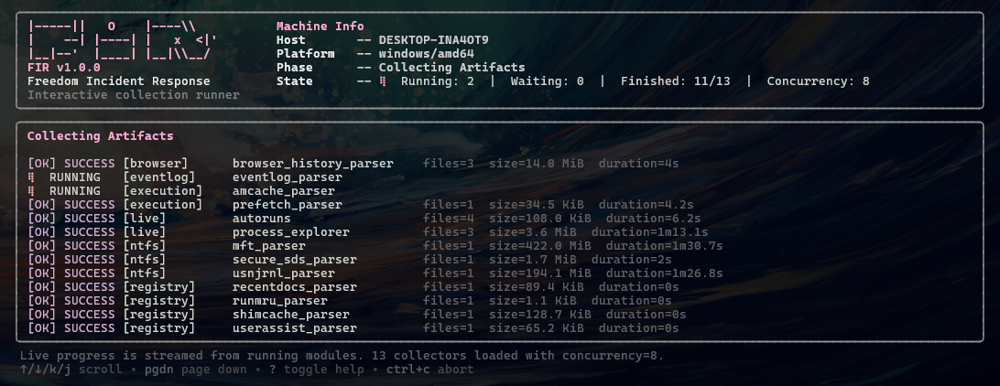

# FIR

<div align="center">

[](https://github.com/Liuchijang/FIR/stargazers)
[](https://github.com/Liuchijang/FIR/network)
[](https://github.com/Liuchijang/FIR/issues)
[](LICENSE)
[](https://go.dev/)

**Freedom Incident Response: a Windows DFIR artifact collection and triage tool written in Go.**

</div>



## Overview

FIR is a Windows-focused DFIR (Digital Forensics and Incident Response) tool for first-response triage. It collects forensic artifacts, runs analyzer modules, writes structured output, and can package the run into a ZIP archive with integrity metadata.

The project is designed around a shared module registry, so collectors and analyzers can be added behind a consistent contract. FIR supports both an interactive terminal UI and a flag-driven CLI mode for repeatable collection workflows.

## Features

- **Dual CLI modes**: Run an interactive Bubble Tea workflow or use `fir collect` for automation.
- **Modular collectors and analyzers**: Built-in modules cover Browser, Event Logs, Execution, Live Response, Memory, NTFS, Registry, and System artifacts.
- **Forensic-safe collection**: Uses read-only collection paths where possible and records SHA-256 integrity metadata.
- **Windows privilege handling**: Detects Administrator context and enables backup, restore, security, and debug privileges when available.
- **Native Windows acquisition**: Uses backup semantics, registry hive save APIs, raw NTFS access, and Windows event log collection.
- **Resource-aware runs**: Supports workers, CPU limit, RAM cap, disk I/O limit, compression, storage estimates, and optional module timeouts.
- **Structured output**: Produces `manifest.json`, `summary.txt`, `collector.log`, optional ZIP archive, and `.zip.sha256` sidecar.
- **Extensible layout**: Collectors and analyzers live under `internal/` with a shared module contract.

## Tech Stack

**Language**


**CLI and TUI**


**Windows and Storage**


## Quick Start

### Prerequisites

- **Operating system**: Windows 10/11 or Windows Server 2016+
- **Privileges**: Administrator is recommended for complete artifact access
- **Go**: 1.26+ for building from source

### Installation

1. Clone the repository:

```powershell
git clone https://github.com/Liuchijang/FIR.git
cd FIR
```

2. Build the executable:

```powershell
go build -trimpath -buildvcs=false -ldflags "-s -w" -o fir.exe .
```

## Usage

### Interactive Mode

Run FIR without a subcommand:

```powershell
.\fir.exe
```

Interactive mode lets you select modules, review runtime configuration, watch live module status, and view the final collection summary.

### Flag Mode

Collect specific artifacts:

```powershell
.\fir.exe collect --artifact registry,eventlog,prefetch
```

Collect by category:

```powershell
.\fir.exe collect --artifact ntfs,execution
```

Collect everything:

```powershell
.\fir.exe collect --artifact all
```

Use a custom output directory and timeout:

```powershell
.\fir.exe collect --artifact registry,eventlog --output C:\triage --timeout 10m
```

Run with resource controls:

```powershell
.\fir.exe collect --artifact all --output E:\evidence --workers 4 --cpu-limit 60 --ram-cap 2GB --disk-io 80MB
```

Disable compression:

```powershell
.\fir.exe collect --artifact ntfs --no-compress
```

### Common Flags

| Flag | Description |
|---|---|
| `-o, --output` | Base output directory for collected artifacts |
| `-v, --verbose` | Enable verbose/debug output |
| `-a, --artifact` | Comma-separated list of artifacts or categories |
| `-t, --timeout` | Optional timeout per module; `0` disables timeout |
| `--workers` | Maximum number of concurrent modules |
| `-c, --concurrency` | Deprecated alias for `--workers` |
| `--cpu-limit` | CPU limit percentage |
| `--ram-cap` | RAM cap, for example `2GB` |
| `--disk-io` | Disk I/O limit, for example `80MB` |
| `--compress` | Compress run directory after collection; enabled by default |
| `--no-compress` | Disable run directory compression |

## Available Modules

### Collectors

| Name | Category | Description |
|---|---|---|
| `browser` | `browser` | Collects browser forensic artifacts from supported Chromium and Firefox profiles |
| `eventlog` | `eventlog` | Collects Windows Event Log files (`.evtx`) |
| `amcache` | `execution` | Collects `Amcache.hve` and transaction logs |
| `prefetch` | `execution` | Collects Windows Prefetch files (`.pf`) |
| `ram` | `memory` | Acquires physical memory using `winpmem` |
| `mft` | `ntfs` | Collects the `$MFT` via raw disk access |
| `secure_sds` | `ntfs` | Collects the `$Secure:$SDS` stream where available |
| `usnjrnl` | `ntfs` | Collects the `$UsnJrnl:$J` USN Change Journal |
| `registry` | `registry` | Collects primary registry hives and transaction logs |
| `srum` | `system` | Collects the SRUM database (`SRUDB.dat`) |
| `wmi` | `system` | Collects WMI repository files |

### Analyzers

| Name | Category | Description |
|---|---|---|
| `autoruns` | `live` | Generates live autoruns-style triage CSV |
| `process_explorer` | `live` | Generates live process, module, and network triage CSV |
| `amcache_parser` | `execution` | Parses Amcache artifacts |
| `browser_history_parser` | `browser` | Parses Chromium browser history artifacts |
| `eventlog_parser` | `eventlog` | Parses EVTX logs |
| `mft_parser` | `ntfs` | Parses `$MFT` into CSV |
| `prefetch_parser` | `execution` | Parses Prefetch artifacts |
| `recentdocs_parser` | `registry` | Parses RecentDocs entries |
| `runmru_parser` | `registry` | Parses RunMRU entries |
| `secure_sds_parser` | `ntfs` | Parses Secure SDS data |
| `shimcache_parser` | `registry` | Parses ShimCache |
| `userassist_parser` | `registry` | Parses UserAssist |
| `usnjrnl_parser` | `ntfs` | Parses USN records and enriches with MFT when available |
| `wmi_parser` | `system` | Parses WMI artifacts |

### Category Shortcuts

Use `browser`, `eventlog`, `execution`, `live`, `memory`, `ntfs`, `registry`, `system`, or `all`.

## Output

A typical run creates a timestamped directory:

```text
HOSTNAME_YYYYMMDD_HHMMSS/
  collector.log
  manifest.json
  summary.txt
  collected/
  analysis/
```

When compression is enabled, FIR writes:

```text
HOSTNAME_YYYYMMDD_HHMMSS.zip.sha256
```

`manifest.json` is the source of truth for run configuration, storage estimates, module results, hashes, and output metadata.

## RAM Acquisition

FIR does not bundle `winpmem`. To enable RAM acquisition, place `winpmem_mini_x64.exe` in one of these locations:

- Same directory as `fir.exe`
- Current working directory
- System `PATH`

If `winpmem` is not found, the RAM module fails gracefully and records the error in the run summary.

## Project Structure

```text
FIR/
  cmd/                 Cobra commands and runtime option parsing
  internal/
    acquisition/       Low-level Windows and raw disk acquisition helpers
    analyzers/         Parsed and enriched output modules
    artifact/          Artifact layout helpers
    collection/        Module resolution, runner, and executor
    collectors/        Artifact acquisition modules grouped by category
    console/           Console/window handling
    logging/           Session logger
    module/            Shared collector/analyzer module contracts and registry
    output/            Manifest, archive, summary, and output writer
    platform/          Host/platform helpers
    resource/          Resource config, estimates, and disk checks
    tui/               Bubble Tea interactive UI
    utils/             Windows privilege, hashing, and file helpers
  main.go              Application entry point
  go.mod               Go module definition
  go.sum               Go dependency checksums
```

Runtime flow:

```text
main -> cmd -> module registry -> collection runner -> collectors/analyzers -> output/logging
```

## Security and Legal Notice

FIR is intended for authorized forensic investigation and incident response only. Run it only on systems where you have explicit permission to collect artifacts.

## Contributing

1. Fork the repository.
2. Create a feature or fix branch.
3. Keep changes focused and aligned with the module structure.
4. Update documentation when behavior changes.
5. Submit a pull request.

## License

This project is licensed under the [MIT License](LICENSE).

## Support

- Issues: [GitHub Issues](https://github.com/Liuchijang/FIR/issues)
- Repository: [Liuchijang/FIR](https://github.com/Liuchijang/FIR)

---

<div align="center">

**Star this repository if FIR is useful for your incident response workflow.**

Made by [Liuchijang](https://github.com/Liuchijang)

</div>
