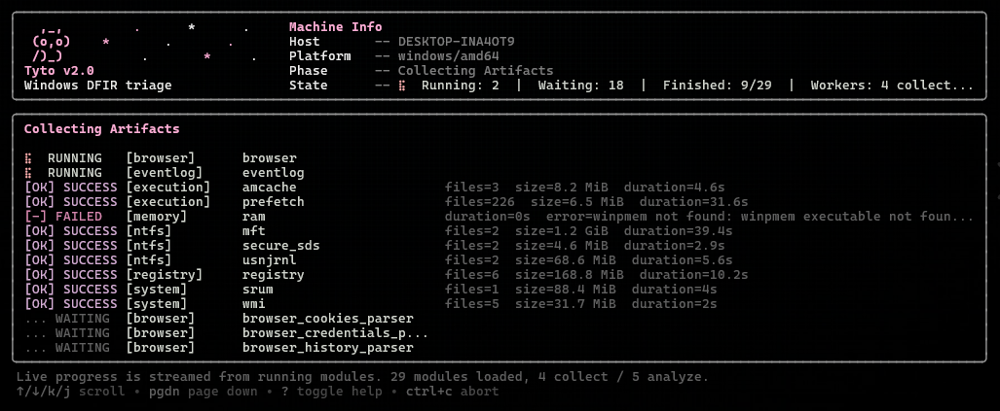

# Tyto

<div align="center">

[](https://github.com/Liuchijang/Tyto/stargazers)
[](https://github.com/Liuchijang/Tyto/network)
[](https://github.com/Liuchijang/Tyto/issues)
[](LICENSE)
[](https://go.dev/)

**A Windows DFIR artifact collection and triage tool written in Go.**

*Named for* Tyto alba, *the barn owl: quiet on the wire, everything on the record.*

</div>



## Overview

Tyto is a Windows first-response triage tool: it collects forensic artifacts, parses them into CSV, and packages the run with integrity metadata. Collectors and analyzers sit behind a shared module contract, and one engine drives both an interactive terminal UI and a flag-driven CLI.

## Features

- **Three ways to run**: an interactive Bubble Tea workflow, `tyto collect` for automation, and `tyto analyze` for a run collected earlier. Collectors run alone by default; `--analyze` adds the parsers for the selected categories.
- **Collect on the host, analyze off it**: `tyto analyze --input <run|zip>` parses a run collected earlier, on the investigator's machine. Live sources are disabled for the whole run — an analyzer whose artifact is missing reports `SKIPPED` rather than describing the analyst's own computer — and the artifacts are re-hashed against the collecting run's manifest before anything parses them.
- **One rule for where an analyzer reads from**: collect *and* analyze in one run and every analyzer reads that run's collected artifacts; `analyze` with no `--input` reads the live host; `analyze --input` reads only the input. There is no fallback between them, so a CSV never quietly describes a source other than the one the manifest names.
- **Native Windows acquisition**: backup semantics, registry hive save APIs, and raw NTFS reads — `$MFT`, `$UsnJrnl:$J` and `$Secure:$SDS` from every fixed drive, not just `C:`. Requires Administrator, and enables the backup, restore, security and debug privileges at startup.
- **Parses what it collects**: `$MFT`, the USN journal, `$Secure:$SDS`, EVTX, Amcache, Prefetch, ShimCache, UserAssist, RecentDocs, RunMRU, WMI, the SRUM database, and browser history, downloads, cookies, saved-login metadata, autofill, bookmarks, extensions and profile settings. Every timestamp column in every CSV uses one RFC3339 UTC layout, so the halves of an output directory join on time without reformatting.
- **Self-tuning concurrency**: no worker knob. Tyto surveys the drives a run reads and writes, then picks a worker count per phase — collection backs off on spinning media, analysis scales with free RAM. The numbers and the reasoning land in `manifest.json`.
- **Caps that reach child processes**: CPU and disk limits go through a Windows Job Object, so `winpmem` and the PowerShell-hosted analyzers are covered rather than quietly exempt. Disk throttling is opt-in.
- **Partial-failure tolerant**: a module fails only if it collected nothing; partial errors surface as warnings instead of hiding the artifacts that did come through.
- **Hashed on the way out**: every artifact is SHA-256'd as it is written rather than read back afterwards, including the ZIP itself. `manifest.json` records a digest per file, and browser artifacts are qualified by user, browser and profile so an entry names exactly one file.
- **Structured output**: `manifest.json`, `summary.txt`, `collector.log`, a storage estimate before the run, and an optional ZIP with a `.sha256` sidecar.

Tyto does not decrypt browser secrets. Cookie values and saved passwords are exported as hex beside a column naming the scheme that wrapped them, because Chrome 127+ App-Bound Encryption is tied to the machine that created it and is worth telling apart from the older DPAPI-keyed form before anyone spends time on recovery. The encrypted stores themselves are collected intact.

## Tech Stack

**Language**


**CLI and TUI**


**Windows and Storage**


`modernc.org/sqlite` reads browser databases and `www.velocidex.com/golang/go-ese` reads the SRUM database's ESE format. Both are pure Go, so a release build stays a single static `tyto.exe` with no runtime dependencies.

## Quick Start

### Prerequisites

- **Operating system**: Windows 10/11 or Windows Server 2016+
- **Privileges**: Administrator for anything that acquires artifacts — interactive mode and `tyto collect` exit immediately with an error if not run elevated. `tyto analyze` is the exception and runs as a normal user, because it reads files the operator already holds
- **Go**: 1.26+ for building from source

### Installation

1. Clone the repository:

```powershell
git clone https://github.com/Liuchijang/Tyto.git
cd Tyto
```

2. Build the executable:

```powershell
go build -trimpath -buildvcs=false -ldflags "-s -w" -o tyto.exe .
```

## Usage

There are three ways to run Tyto, and they differ in **where an analyzer reads
its sample from**. That is the part worth getting right: it decides which machine
the CSVs describe.

| How it is run | Analyzers read from | Administrator |
|---|---|---|
| `collect --artifact <category> --analyze` | the artifacts this run just collected | required |
| `analyze` with no `--input` | the live machine | required |
| `analyze --input <run\|zip>` | only the input, never the live machine | not required |

There is no fallback between them. An analyzer that should read a collected
artifact and cannot reports `SKIPPED` or `FAILED` rather than quietly answering
from somewhere else, so a CSV never describes a source other than the one
`manifest.json` names.

### Interactive

Run Tyto without a subcommand:

```powershell
.\tyto.exe
```

Interactive mode lets you select modules, review runtime configuration, watch live module status, and view the final collection summary.

### tyto collect

Acquires artifacts from the machine it runs on. Collector modules only by default
— analyzers (`*_parser`) are skipped even if a category or `all` would otherwise
include them, and `--analyze` opts into them. `autoruns` and `process_explorer`
are collectors, so they run without it.

```powershell
.\tyto.exe collect --artifact registry,eventlog,prefetch     # by module name
.\tyto.exe collect --artifact ntfs,execution                 # by category
.\tyto.exe collect --artifact all                            # everything
.\tyto.exe collect --artifact ntfs --analyze                 # collect, then parse what was collected
.\tyto.exe collect --artifact registry --output C:\triage --timeout 10m
.\tyto.exe collect --artifact all --output E:\evidence --cpu-limit 60 --disk-io 80MB
.\tyto.exe collect --artifact ntfs --no-compress
```

**`--analyze` follows categories, not module names.** `--artifact ntfs --analyze`
adds `mft_parser`, `usnjrnl_parser` and `secure_sds_parser` because `ntfs` is a
category; `--artifact mft --analyze` adds nothing at all, because `mft` names one
module and that module is a collector. The flag is silently a no-op there. Use a
category name, or list the parsers explicitly:

```powershell
.\tyto.exe collect --artifact mft,mft_parser --analyze
```

| Flag | Description |
|---|---|
| `-a, --artifact` | Comma-separated modules or categories, or `list` to print every module with its description. Required |
| `--analyze` | Also run the analyzers for the selected categories. Off by default |
| `-o, --output` | Base directory the run directory is created in. Defaults to `.` |
| `-t, --timeout` | Timeout per module; `0` (the default) disables it |
| `--cpu-limit` | CPU cap for Tyto and every process it spawns, via a Windows Job Object. Defaults to 60, clamped to 10–80 |
| `--disk-io` | Disk bandwidth cap for Tyto and every process it spawns, e.g. `80MB`. No cap by default |
| `--compress` / `--no-compress` | Zip the run directory when finished. **On** by default |
| `-v, --verbose` | Verbose/debug output |

### tyto analyze

Runs analyzer modules. `--input` decides which machine they describe, and that is
the only difference between the two ways to call it.

```powershell
# Offline: parse a run collected earlier, on the investigator's machine.
.\tyto.exe analyze --input D:\evidence\HOST_20260812_134006.zip        # a compressed run, what collect leaves by default
.\tyto.exe analyze --input D:\evidence\HOST_20260812_134006 -o D:\cases\1234
.\tyto.exe analyze --input HOST_20260812_134006.zip --artifact ntfs,eventlog

# Live: no --input, so the analyzers read this machine. Requires Administrator.
.\tyto.exe analyze --artifact shimcache_parser,prefetch_parser
.\tyto.exe analyze --artifact wmi_parser                               # carve the live OBJECTS.DATA, plus a CIM query
```

| Flag | Description |
|---|---|
| `-i, --input` | The run directory or `.zip` to analyze. Omit it to analyze the live machine instead |
| `-a, --artifact` | Comma-separated analyzers or categories, or `list` to print every module with its description. Defaults to `all` |
| `--keep-extracted` | Keep the directory an input archive was extracted into, instead of removing it when the run ends |
| `-o, --output` | Base directory the analysis run directory is created in. Defaults to `.` |
| `-t, --timeout` | Timeout per analyzer; `0` (the default) disables it |
| `--cpu-limit` | CPU cap for Tyto and every process it spawns, via a Windows Job Object. Defaults to 60, clamped to 10–80 |
| `--disk-io` | Disk bandwidth cap for Tyto and every process it spawns, e.g. `80MB`. No cap by default |
| `--compress` | Zip the analysis output when finished. **Off** by default, unlike collection — the output is CSV an analyst opens straight away |
| `-v, --verbose` | Verbose/debug output |

There is no `--no-compress` here; compression is already off unless `--compress`
asks for it.

## Available Modules

### Collectors

| Name | Category | Description |
|---|---|---|
| `browser` | `browser` | Collects browser artifacts from Chromium and Firefox profiles: history, cookies, credential stores, bookmarks, preferences, session files, the flat LevelDB stores (Local Storage, Session Storage, Platform Notifications, Service Worker, Sync Data), and extension manifests without the extension payloads. `IndexedDB` and the HTTP cache are left out — hundreds of megabytes per profile for artifacts nothing here parses yet |
| `eventlog` | `eventlog` | Collects Windows Event Log files (`.evtx`) |
| `amcache` | `execution` | Collects `Amcache.hve` and transaction logs |
| `prefetch` | `execution` | Collects Windows Prefetch files (`.pf`) |
| `ram` | `memory` | Acquires physical memory using `winpmem` |
| `mft` | `ntfs` | Collects the `$MFT` via raw disk access, from every fixed drive |
| `secure_sds` | `ntfs` | Collects the `$Secure:$SDS` stream, from every fixed drive |
| `usnjrnl` | `ntfs` | Collects the `$UsnJrnl:$J` USN Change Journal, from every fixed drive |
| `autoruns` | `live` | Captures autostart configuration from the running system: services, run keys per machine and per user SID, scheduled tasks with their actions and triggers, and every startup folder. **Live state, not an artifact** |
| `process_explorer` | `live` | Captures running processes with command lines and owners, every loaded module, and TCP/UDP connections joined to the owning process. Falls back to `netstat -ano` where the `Get-Net*` cmdlets are unavailable. **Live state, not an artifact** |
| `registry` | `registry` | Collects primary registry hives and transaction logs (excludes `SECURITY`, which requires `SYSTEM`, not just Administrator) |
| `srum` | `system` | Collects the SRUM database (`SRUDB.dat`) |
| `wmi` | `system` | Collects WMI repository files |

### Analyzers

Most analyzers read an artifact, so they work against a collected run or the live
machine, so every one of them is available to `analyze --input`.

`autoruns` and `process_explorer` are **collectors**, listed above. They acquire
state that exists only while the machine is running, and the runner finishes every
collector before it starts any analyzer — so as analyzers they captured the most
volatile data in a run only after every artifact had been copied, a memory image
included. Use `collect` for them, not `analyze`.

| Name | Category | Description |
|---|---|---|
| `amcache_parser` | `execution` | Parses Amcache artifacts |
| `browser_history_parser` | `browser` | Parses visits and downloads from Chromium `History` and Firefox `places.sqlite`. Downloads carry the redirect chain and the decoded Safe Browsing verdict |
| `browser_cookies_parser` | `browser` | Parses cookie metadata — host, path, creation, expiry, last access, `Secure`/`HttpOnly`/`SameSite` — from every cookie store a profile has |
| `browser_credentials_parser` | `browser` | Parses saved-login metadata and autofill from `Login Data`, `Web Data`, `logins.json` and `formhistory.sqlite`. Separate from the other browser analyzers so a triage can skip the most sensitive artifacts |
| `browser_profile_parser` | `browser` | Parses bookmarks with folder paths, installed extensions with their permissions and content scripts, selected profile settings, omnibox shortcuts, media history and DIPS bounce records |
| `eventlog_parser` | `eventlog` | Parses EVTX logs |
| `mft_parser` | `ntfs` | Parses `$MFT` into CSV, streaming one row per record with resolved full paths |
| `prefetch_parser` | `execution` | Parses Prefetch artifacts |
| `recentdocs_parser` | `registry` | Parses RecentDocs entries |
| `runmru_parser` | `registry` | Parses RunMRU entries |
| `secure_sds_parser` | `ntfs` | Parses Secure SDS data |
| `shimcache_parser` | `registry` | Parses ShimCache |
| `srum_parser` | `system` | Parses the SRUM database into one CSV per provider table, resolving application and user IDs through `SruDbIdMapTable`, network adapter types out of the interface LUID, and Wi-Fi profile names from the `SOFTWARE` hive |
| `userassist_parser` | `registry` | Parses UserAssist |
| `usnjrnl_parser` | `ntfs` | Parses USN records, joining in each record's `$MFT` name, path and timestamps when `mft` or `mft_parser` is part of the run |
| `wmi_parser` | `system` | Reports WMI event-subscription persistence from two sources. It carves `__FilterToConsumerBinding`, `__EventFilter` and the consumer records out of `OBJECTS.DATA` — the run's collected copy, or the live host's file — which is what makes it work offline and what lets it recover subscriptions already deleted from the repository. When analyzing the live machine it additionally queries `root\subscription` for the authoritative current view plus the namespace tree. The two sets of CSVs keep separate names because they are separate evidence |

### Category Shortcuts

Use `browser`, `eventlog`, `execution`, `live`, `memory`, `ntfs`, `registry`,
`system`, or `all`. A category name selects every module in it, collectors and
analyzers alike. `live` is the one exception in practice: it now holds only
collectors, so `collect --artifact live` runs both of them and
`analyze --artifact live` has nothing to run.

Both lists above are also available from the binary, generated from the module
registry rather than transcribed — `tyto collect --help` prints each category with
the modules in it, and `--artifact list` prints every module with its description.

## Timestamps

**Every timestamp column in every CSV is RFC3339 in UTC, and the value is the
artifact's own.** Nothing is re-based on the way out: a FILETIME, a WebKit
microsecond count and a PE `TimeDateStamp` are already UTC where they are stored,
so the instant in the CSV is the instant in the artifact. Most column names carry
a `UTC` suffix to say so.

Two properties worth knowing before comparing Tyto's output against another tool:

- **A timestamp column holds an instant or it is empty** — never the raw integer,
  never `N/A`. Importers bind such a column to a date type and reject the *whole
  file* over one cell that will not convert, so a value Tyto cannot resolve costs
  one blank cell rather than the artifact.
- **Sub-second precision survives.** The layout is RFC3339 *Nano*: a FILETIME
  carries 100ns and a USN journal records many events inside one second. A whole
  second renders with no fraction, so both forms parse as plain RFC3339.

| Module | Timestamp columns | What the artifact stores |
|---|---|---|
| `mft_parser` | `SI_CreatedUTC`, `SI_ModifiedUTC`, `SI_MFTModifiedUTC`, `SI_AccessedUTC`, and the four `FN_*UTC` equivalents | FILETIME — 100ns ticks since 1601-01-01 UTC |
| `usnjrnl_parser` | `TimestampUTC`, plus the `$MFT` times joined in when `mft`/`mft_parser` is in the run | FILETIME |
| `secure_sds_parser` | none — `$Secure:$SDS` carries no timestamps | — |
| `prefetch_parser` | `CreatedUTC`, `ModifiedUTC`, `AccessedUTC` | The **`.pf` file's own filesystem timestamps**, not the run times recorded inside it |
| `eventlog_parser` | `TimeCreatedUTC` | EVTX record `SystemTime` (FILETIME), rendered through .NET's round-trip `"o"` format under the invariant culture so the column never depends on the operator's regional settings |
| `amcache_parser` | `KeyLastWriteTimestamp`, `FileKeyLastWriteTimestamp` | Hive key last-write FILETIME |
| | `DriverTimeStamp` | A `REG_DWORD` holding the driver's PE `TimeDateStamp` — Unix epoch **seconds**, not a FILETIME |
| | `DriverVerDate`, `Date`, `DriverLastWriteTime`, `LinkDate` | Text values inside the hive — see the caveat below |
| `shimcache_parser` | `LastModifiedUTC`, `LastUpdateUTC` | FILETIME inside the cache entry |
| `userassist_parser` | `LastExecutedUTC`, `KeyLastWriteTimestamp` | FILETIME in the value blob and on the hive key. `FocusTimeMS` beside them is a **duration** in milliseconds, not an instant |
| `recentdocs_parser`, `runmru_parser` | `KeyLastWriteTimestamp` | Hive key last-write FILETIME |
| `srum_parser` | per provider table — `ConnectStartTime`, `*TimeStamp`, … | FILETIME for most columns and an ESE `DateTime` for others; both are accepted. `ConnectedTime` is a **duration** in seconds and is added to the row's start time rather than printed |
| `browser_*_parser`, Chromium | `VisitTimeUTC`, `LastVisitUTC`, `CreationUTC`, `ExpiresUTC`, `DateAddedUTC`, … | Microseconds since **1601-01-01** (the WebKit epoch) |
| `browser_*_parser`, Firefox | the same columns | Microseconds since **1970-01-01** — except `logins.json`, which uses **milliseconds** |
| `browser_profile_parser` | the Media History columns | Unix epoch **seconds** |
| `autoruns`, `process_explorer` (collectors) | `LastRunTimeUTC`, `NextRunTimeUTC`, `LastWriteTimeUTC`, `CreationDateUTC`, `CreationTimeUTC` | A .NET `DateTime` in **local** time, converted by `ConvertTo-TytoUtc`. Along with `eventlog_parser` these are the only paths that convert rather than re-render, because .NET hands the script local time |
| `wmi_parser` | none | The object store keeps no creation time for a subscription and the CIM query selects no date-bearing property, so no column is named after one |


## RAM Acquisition

Tyto does not bundle `winpmem`. To enable RAM acquisition, place `winpmem_mini_x64.exe` in one of these locations:

- Same directory as `tyto.exe`
- Current working directory
- System `PATH`

If `winpmem` is not found, the RAM module fails gracefully and records the error in the run summary.

## Security and Legal Notice

Tyto is intended for authorized forensic investigation and incident response only. Run it only on systems where you have explicit permission to collect artifacts.

## Contributing

1. Fork the repository.
2. Create a feature or fix branch.
3. Keep changes focused and aligned with the module structure.
4. Update documentation when behavior changes.
5. Submit a pull request.

## License

This project is licensed under the [MIT License](LICENSE).

## Support

- Issues: [GitHub Issues](https://github.com/Liuchijang/Tyto/issues)
- Repository: [Liuchijang/Tyto](https://github.com/Liuchijang/Tyto)

---

<div align="center">

**Star this repository if Tyto is useful for your incident response workflow.**

Made by [Liuchijang](https://github.com/Liuchijang)

</div>
